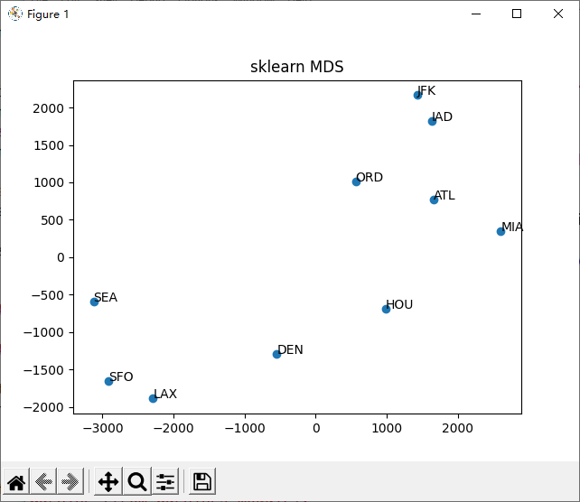

# MDS

Multidimensional scaling, referred to as MDS, is a method of analyzing data. It is worth noting that PCA is a special form of MDS.

To illustrate what MDS is, let's take a simple example:


### cities.csv

```python
,ATL,ORD,DEN,HOU,LAX,MIA,JFK,SFO,SEA,IAD
ATL,0,587,1212,701,1936,604,748,2139,2182,543
ORD,587,0,920,940,1745,1188,713,1858,1737,597
DEN,1212,920,0,879,831,1726,1631,949,1021,1494
HOU,701,940,879,0,1374,968,1420,1645,1891,1220
LAX,1936,1745,831,1374,0,2339,2451,347,959,2300
MIA,604,1188,1726,968,2339,0,1092,2594,2734,923
JFK,748,713,1631,1420,2451,1092,0,2571,2408,205
SFO,2139,1858,949,1645,347,2594,2571,0,678,2442
SEA,2182,1737,1021,1891,959,2734,2408,678,0,2329
IAD,543,597,1494,1220,2300,923,205,2442,2329,0
```

The picture above shows some cities in the United States, and each city has an airport. If we now know the distance between every two airports, but we don't know the distribution of these airports, how can we draw the distribution of airports?

```python
####################
# get csv data
####################

f = open('cities.csv', 'r')
lines = f.readlines()
f.close()

airports = lines[0].replace('\n', '').split(',')[1:]
dist = []

for line in lines[1:]:
    line = line.replace('\n', '').split(',')[1:]
    line = list( map(int, line) )
    dist.append(line)

import numpy as np
dist = np.array(dist)

print(airports)
print(dist)

####################
# MDS
####################

import matplotlib.pyplot as plt
from sklearn.manifold import MDS

clf = MDS(2)
clf.fit(dist)
dist_mds = clf.fit_transform(dist)

x = dist_mds[:, 0]
y = dist_mds[:, 1]

plt.scatter( x, y )
for i in range(len(airports)):
    plt.annotate( airports[i],
                  xy = ( x[i], y[i] ),
                  xytext = ( x[i], y[i] )
                  )

plt.title('sklearn MDS')
plt.show()
```



Using MDS, you can extract the relative position information between these airports (you will find that the results of each operation are different, that is because we only know the distance between each two airports, but we do not know their latitude and longitude, So the map might be rotated or flipped.)

You will find that the role of MDS is the same as that of PCA. It reduces the dimensionality of the data, so that a high-dimensional data can become low-dimensional data without losing the amount of information as much as possible (keep the relationship between the data as much as possible (distance between the data). ) to achieve data dimensionality reduction)

As will be mentioned in the page rank that we will talk about later, these methods can extract a lot of important information. For example, I want to recommend movies to users. I now have a lot of users' movie ratings and their movie lists. Then I can then recommend movies to other users that they might be interested in based on the data I know.


<mark style="color:red;">**Recommendation algorithm**</mark>

Big data + recommendation algorithm is dangerous, because according to big data analysis, computer can understand human better than human, computer can predict what you will do in the future based on your past experience before you make a decision.

This can be achieved at the level of perfection in the era of artificial intelligence. Before there was no high computing power system such as a graphics card 20 years ago, collaborative filtering can predict user behavior well and achieve a considerable accuracy. (more precise than humans)

It has to be admitted that there is a strong similarity between humans. For example, after watching **Toy Story**, a person may go to watch similar movies, such as **How to Train Your Dragon**. If we can master crowd big data, then we can use probabilistic models or deep learning models (non-linear hyperparameter probabilistic models) to predict crowd dynamics and predict the behavior of an individual in the future.

Isn't this a bit like the plot of some AI-controlled human sci-fi movie? Like **Terminator** series. It’s no exaggeration to say that this prediction was made a long time ago with astonishing accuracy.


## Statistics

Start time of this page: February 2, 2022

Completion time of this page: February 6, 2022
