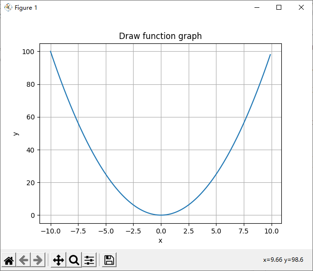

# 2 Variability and address

Python is a label language, which is very different from the C language.&#x20;

In python, each variable name is a pointer to the corresponding memory unit.

```python
>>> a = 5
>>> a
5
>>> id(a)
140735234512784
>>> 
```

We can use the id() method to get the address of the memory unit pointed to by a variable.

In this example, the variable name **a** points to the memory address numbered **140735234512784**, and the memory address stores an **int** type data, the value of this data is **5**.

As shown in the figure below:




If I copy a variable in python, for example, as shown below:

```python
>>> a = 5
>>> b = a
>>> 
>>> a
5
>>> b
5
>>> 
>>> id(a)
140735234512784
>>> id(b)
140735234512784
>>> 
```

You will find that the memory address units pointed to by **a** and **b** are the same! That is to say, when I tried to copy a variable, I didn't really clone the variable, but: I created another pointer points to the memory, and the two pointers point to the same memory space.

 (1).png>)

This means that when I try to change the content of **a**, the content of **b** will also change<mark style="color:red;">**???**</mark>


<mark style="color:red;">**Not always, This is the real trouble!**</mark>


If I change the value of **a**, but the address of **a** does not change, the value of **b** will also change accordingly.&#x20;

Then we say that this is a **variable** data type.

.png>)

But if I change the value of **a**, but **a** points to another address, then **b** still points to the original address, and the values of **a** and **b** are different.

Then we say that this is an **immutable** data type.

.png>)


<mark style="color:red;">**Numbers are immutable**</mark>


```python
>>> a = 5
>>> b = a
>>> 
>>> id(a)
140735234512784
>>> id(b)
140735234512784
>>> 
>>> a = 10
>>> b
5
>>> id(a)
140735234512944
>>> id(b)
140735234512784
>>> 
```


