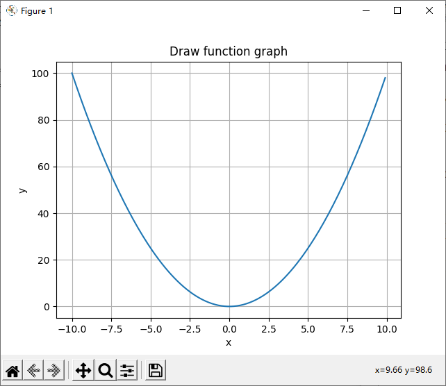

# 4 line chart

The line chart is to use lines to represent data. It is generally used to see the trend of the data, whether it is a positive ratio (increasing) or an inverse ratio (decreasing)

For example, here is a piece of data about income and outlay

```python
income = [1200, 1400, 1600, 1800, 2000, 2200, 2400]
outlay = [1000, 1240, 1320, 1500, 1790, 1924, 2218.75]
```

Each income corresponds to an outlay

If we use the following procedure, we can draw a clear diagram of the relationship between income and expenditure:

```python
income = [1200, 1400, 1600, 1800, 2000, 2200, 2400]
outlay = [1000, 1240, 1320, 1500, 1790, 1924, 2218.75]

import matplotlib.pyplot as plt

plt.plot(income, outlay)

plt.title('The relationship between income and outlay')
plt.xlabel('income')
plt.ylabel('outlay')

plt.grid()
plt.show()
```

.png>)

In this graph, we will find that when income increases, expenditures will increase accordingly.&#x20;


A typical use scheme of line chart is to draw function image.

For example, we can use the following code to draw an image of a quadratic function.

```python
import matplotlib.pyplot as plt
import numpy as np
 
x = np.arange(-10, 10, 0.1)
y = x ** 2
 

plt.plot(x, y)

plt.title('Draw function graph')
plt.xlabel('x')
plt.ylabel('y')

plt.grid()
plt.show()
```



We can also draw images of two functions in the same picture.

For example, in the figure below, I have drawn the sine and cosine images at the same time.

```python
import matplotlib.pyplot as plt
import numpy as np
 
x = np.arange(-np.pi, np.pi, 0.1)
y1 = np.sin(x)
y2 = np.cos(x)
 

plt.plot(x, y1, label = 'sin')
plt.plot(x, y2, label = 'cos')

plt.title('Draw function graph')
plt.xlabel('x')
plt.ylabel('y')

plt.grid()
plt.legend()
plt.show()
```

.png>)


## Statistics

Start time of this page: December 19, 2021

Completion time of this page: December 19, 2021
